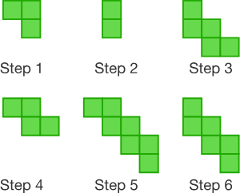

## Desafio 5

Crie uma function que receba um número e retorne a quantidade de quadrados de acordo com a sequência:



* Step 0: Começa com 0
* Step 1: Adiciona 3
* Step 2: Subtrai 1
* Repete Step 1 & 2 ...


##### Exemplos
```js
boxSeq(0) 
// ➞ 0

boxSeq(1) 
// ➞ 3

boxSeq(2) 
// ➞ 2
```